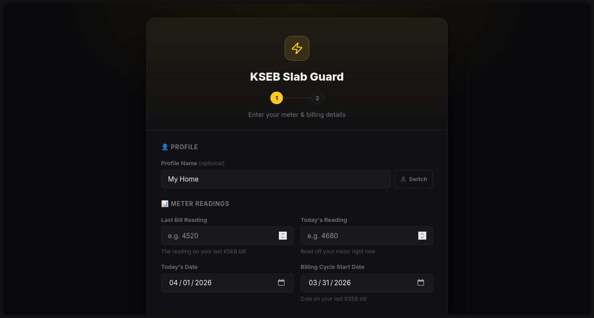
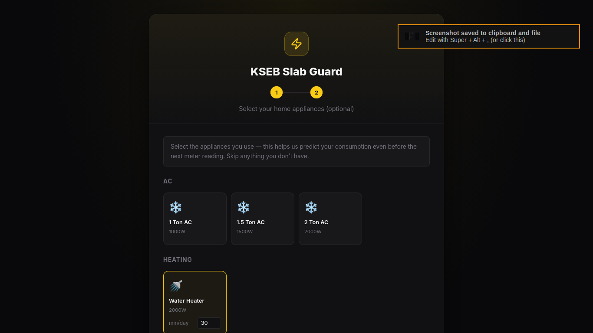
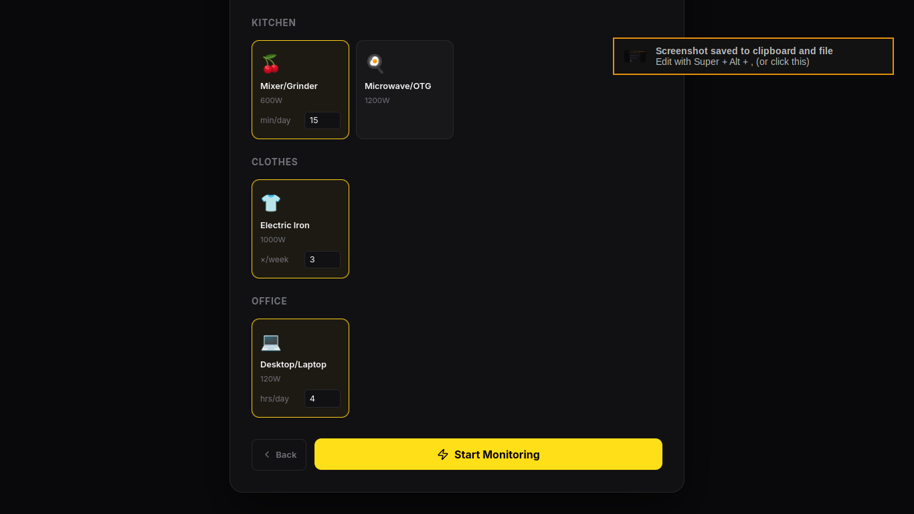

# Project Name

## Problem Statement
Explain clearly what problem your project is solving.

## Project Description
Describe your solution, how it works, and what makes it useful.

---

## Google AI Usage
### Tools / Models Used
- 

### How Google AI Was Used
Explain clearly how AI is integrated into your project.

---

## Proof of Google AI Usage
Attach screenshots in a `/proof` folder:



---

## Screenshots 
Add project screenshots:

  


---

## Demo Video
Upload your demo video to Google Drive and paste the shareable link here(max 3 minutes).
[Watch Demo](#)

---

## Installation Steps

```bash
# Clone the repository
git clone <https://github.com/viswajith-vidyanand/kseb-predictor.git>

# Go to project folder
cd project-name

# Install dependencies
npm install

# Run the project
npm start
